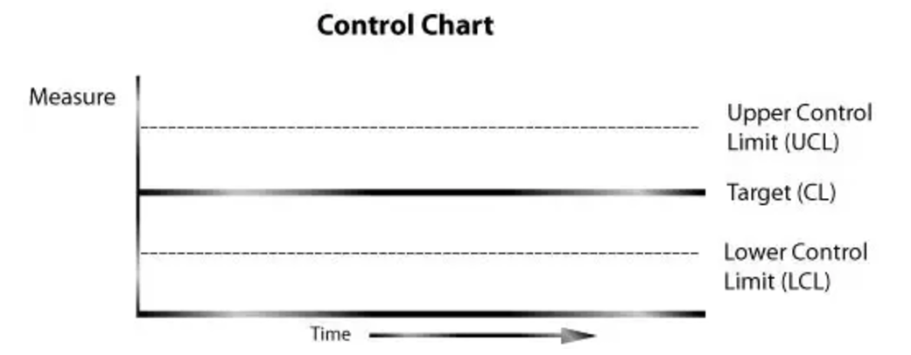
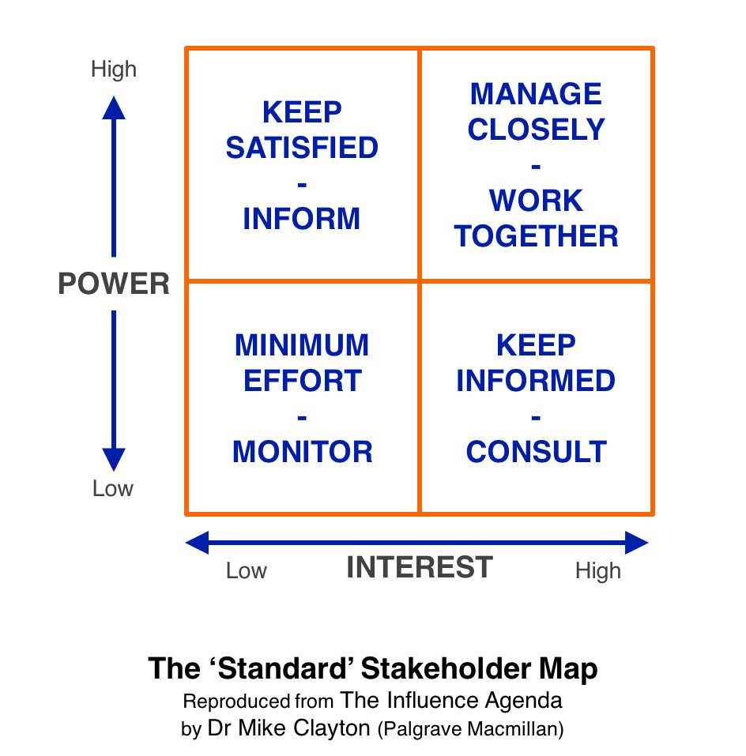

# PMP 筆記

## General
### PMP Charts

### The 5 Process Groups

#### Initiating
These processes help you define a new piece of work – either a complete new project or the phase you are about to begin. They ensure you have authority to proceed.
#### Planning
These processes help you define objectives and scope out the work to be done. They also encompass all the work around planning and scheduling tasks. Again, they can cover a complete project or just the phase you are working on right now. Or you might be closing one phase and planning the next in parallel.
#### Executing
You do these processes as you carry out your project tasks. This is the ‘delivery’ part of project management, where the main activity happens and you create the products.
#### Monitoring and Controlling
These processes let you track the work that is being done, review and report on it. They also cover what happens when you find out the project isn’t following the agreed plan, so change management falls into this Process Group. You’ll run these processes alongside those in the Executing Group (mainly, but alongside the other Groups too) so you monitor as you go.
#### Closing
Finally, these processes let you finalize all the tasks in the other Groups when you get to the point to close the project or phase.
##### Close Type of Project Termination
1.Termination by integration and termination by
addition
- Successful cases: project outputs integrated and/or
used as input for another project/production

2.Termination by starvation
- Project ends because resources run out.

3.Termination by extinction
- Termination by management because the project failed
(objectives not met, superseded, not profitable)

##### 1. Project a temporary ==endeavor== undertaken to create a unique product or service (endeavor:an attempt to achieve a goal)

#### 2. Project Management 3 important factors:Scope/Cost/Time

## 1.Project Integration Management

### SOW
The project statement of work (SOW) is a narrative(敘述) description of products, services, or results to be delivered by a project.
The SOW references the following:
1. Business need
- An organization's business need may be based on a market demand, technological advance, legal requirement, government regulation, or environmental consideration.
Typically, the business need and the cost-benefit analysis are contained in the business case to justify the project.
2. Product scope description
- The product scope description documents the characteristics of the product, service, or results that the project will be undertaken to create. The description should also document the relationship between the products, services, or results being created and the business need that the project will address.
3. Strategic plan
- The strategic plan documents the organization's strategic vision, goals, and objectives and may contain a high-level mission statement.

### Develop Project Charter
Develop Project Charter is the process of developing a document that formally authorizes the existence of a project and provides the project manager with the authority to apply organizational resources to project activities.

### Business Case (商業論證)
The business case describes the necessary information from a business standpoint to determine whether or not the project is worth the required investment.
It is commonly used for decision making by managers or executives above the project level.
The business need and the cost-benefit analysis are contained in the business case to justify and establish boundaries for the project.
The business case is created as a result of one or more of the following:
1. Market demand (e.g., a car company authorizing a project to build more fuel-efficient cars in response to gasoline shortages),
2. Organizational need (e.g., due to high overhead costs a company may combine staff functions and streamline processes to reduce costs.),
3. Customer request (e.g., an electric utility authorizing a project to build a new substation to serve a new industrial park),
4. Technological advance (e.g., an airline authorizing a new project to develop electronic tickets instead of paper tickets based on technological advances),
5. Legal requirement (e.g., a paint manufacturer authorizing a project to establish guidelines for handling toxic materials),
6. Ecological (生態) impacts (e.g., a company authorizing a project to lessen its environmental impact), or
7. Social need (e.g., a nongovernmental organization in a developing country authorizing a project to provide potable water systems, latrines, and sanitation education to communities suffering from high rates of cholera).

### Enterprise Environmental Factors(EEF)
The enterprise environmental factors that can influence the Develop Project Charter process include, but are not limited to:
1. Governmental standards, industry standards, or regulations (e.g. codes of conduct, quality standards, or worker protection standards),
2. Organizational culture and structure, and
3. Marketplace conditions.

### Organizational Process Assets(OPA)
The organizational process assets that can influence the Develop Project Charter process include, but are not limited to:
1. Organizational standard processes, policies, and process definitions,
2. Templates (e.g., project charter template), and
3. Historical information and lessons learned knowledge base (e.g., projects, records, and documents; all project closure information and documentation; information about both the results of previous project selection decisions and previous project performance information; and information from the risk management activity).

### Develop Project Management Plan
- Develop Project Management Plan is the process of defining, preparing, and coordinating all subsidiary plans and integrating them into a comprehensive project management plan.
- The project management plan defines how the project is executed, monitored and controlled, and closed.
- This process results in a project management plan that is progressively elaborated by updates, and controlled and approved through the Perform Integrated Change Control process.
- Subsidiary management plans from each knowledge area:
1. Project scope management plan
2. Schedule management plan
3. Cost management plan
4. Quality management plan
5. Process improvement plan
6. Staffing management plan
7. Communication management plan
8. Risk management plan
9. Procurement management plan
10. Stakeholder management plan

- Other components, such as:
1. Milestone list
2. Resource calendar
3. Schedule baseline
4. Cost baseline
5. Quality baseline
6. Risk register

## 2.Project Scope Management
### Collect reauirement
Group cerativity techniques:
1. Start gathering requirements by using the **mind mapping technique**.
Start with a topic, an issue or an area that you want to collect requirements for and develop ideas around it. Group the ideas visually, as a mind map, by writing down each idea and drawing how it relates to the initial topic. Ideally, you let anyone in the workshop create his or her own mind map.

2. Continue the process with a **brainstorming** session.
Allow anyone in the workshop to generate an unstructured requirements list for each idea captured on the mind map. To ensure that the brainstorming remains focused on the initial topic, lay basic ground rules and let anyone freely generate fresh ideas and requirements on the topic.

3. Use the list of unstructured ideas and requirements to build an **affinity diagram**, where your ideas are organized into groups based on their natural relationship. Let anyone in the workshop participate in organizing the items in the most natural group they can.

4. Identify the most important requirements by applying the **nominal group technique**. Allow each member or group in the workshop to identify which requirements are the most important for him or her. Rank each requirement on the affinity diagram with a priority: low, medium, high or from one to five. To avoid conflicts, facilitate an anonymous priority appraisal and ranking. Finally, tally the results and identify the most important requirements.

5. Close the process by running several rounds of independent feedback through the **Delphi technique**. Let any individual or group revise the list of requirements. Share an anonymous outcome from each review round and continue with further rounds, keeping in mind the objective to reach consensus and convergence.
[Group Creativity Techniques to Collect Requirements]
(https://www.projectmanagement.com/blog-post/8359/Group-Creativity-Techniques-to-Collect-Requirements-)
### Collect Requirements:
Collect Requirements is the process of determining, documenting, and managing stakeholder needs and
requirements to meet project objectives. The key benefit of this process is that it provides the basis for defining and managing the project scope including product scope.

Tools and Techniques:

1. Interviews - An interview is a formal or informal approach to stakeholders by talking to them directly.
2. Focus Groups - bring together prequalified stakeholders and subject matter experts to learn about their expectations and attitudes about a proposed product. A trained moderator guides the group through an interactive discussion, designed to be more conversational than a one-on-one interview.
3. Facilitated Workshops - Facilitated workshops are focused sessions that bring key stakeholders together to define product requirements. Workshops are considered a primary technique for quickly defining cross-functional requirements and reconciling stakeholder differences.
The primary difference between focus groups and facilitated workshops are that focus groups are gatherings of prequalified subject matter experts and stakeholders and facilitated workshops consist of cross-functional stakeholders who can define cross-functional requirements.
4. Group creativity techniques
	1. Brainstorming
	2. Nominal group technique - brainstorming with a voting.
	3. Idea/mind mapping - A technique in which ideas created through individual brainstorming sessions are consolidated into a single map to reflect commonality and differences in understanding, and generate new ideas.
	4. Affinity diagram - A technique that allows large numbers of ideas to be classified into groups for review and analysis.
	5. Multicriteria decision analysis - A technique that utilizes a decision matrix to provide a systematic analytical approach for establishing criteria, such as risk levels, uncertainty, and valuation, to evaluate and rank many ideas.
5. Group decision-Making techniques
	1. Unanimity (一致同意)
	2. Majority (大多數同意 > 50%)
	3. Plurality (相對多數同意, 通常在候選項超過兩個時使用)
	4. Dictatorship (獨裁)
6. Questionnaires and Surveys
7. Observations - viewing individuals in their environment and how they perform their jobs or tasks and carry out processes. Observation is also known as “job shadowing.”
8. Prototypes
9. Benchmarking - 標杆對照將實際或計劃的做法（如流程和操作過程）與其他可比組織的做法進行比較，以便識別最佳實踐，形成改進意見，並為績效考核提供依據。標杆對照所采用的可比組織可以是內部的，也可以是外部的。
10. Context Diagrams
11. Document Analysis
12. 責任分派矩陣(Responsibility Assignment Matrix)：組織成員對
工作的權責
R( Primary Responsibility), I( Keep Informed), S( Support, active involvement), C (Consult or provide advice)
或RACI R=Responsible （負責）A=Accountable （承擔） C=Consult（諮詢） I=Inform（分享）

### Three types of project life cycles
1.Predictive (also known as fully plan-driven)
2.Iterative and Incremental
3.Adaptive (also known as change-driven or agile)

## 3.Project Time Management
### Activity Duration = (EF-ES)+1 (活動工時計算)
ES:Early Start
EF:Early Finished

## 4.Project Cost Management
### Backlog

A backlog is a high-level list of everything that the team needs to work on. It is therefore the “What” that needs to be accomplished, sorted by importance.  The backlog is used in the release and iteration (sprint) planning sessions as the source of features and work to draw from and plan for completion within the time period.

## 5.Project Quality Management
### The Rule of Seven
- The Rule of Seven is a result of the Statistical Process Control (SPC) discipline, of Quality Management. SPC helps you determine if your processes are “in control” or “out of control.” First, you build your control chart, and establish your Control Limits..
- Basically, if seven or more data points fall on one side of the center line (Target), your process is considered “out of control”, and your team needs to investigate the cause of the problem to get your process back “in control.”

[source from https://www.quora.com/What-is-the-rule-of-seven-in-project-management](https://www.quora.com/What-is-the-rule-of-seven-in-project-management)

#### out of control
- A data point falls outside of the upper or lower control limits.
- 7 consecutive data points in a row fall above or below the mean.
- 7 consecutive data points in a row trending up or down (crossing the mean).

### Work Performance Data(WPD) vs Work Performance Information(WPI)
- WPD:As per the PMBOK Guide, the work performance data is “the raw observations and measurements identified during activities performed to carry out the project work; e.g. actual cost, actual duration, and percent of work physically completed.”
- WPI:As per the PMBOK Guide, the work performance information is “the performance data collected from various controlling processes, analyzed in context and integrated based on relationships across areas; e.g. status of deliverables, and forecasted estimates to complete, etc.”

- Work performance data is the “as of now” status of the project status, it provides the current status of the project, and work performance information is a comparison between the actual performance with the planned performance.
- Examples of work performance data are the actual cost spent, actual time elapsed, etc. Examples of work performance information are Cost Variance, Schedule Variance, Cost Performance Index, and Schedule Performance Index, etc.
https://pmstudycircle.com/2013/10/work-performance-data-wpd-and-work-performance-information-wpi/

## 6.Project Human Resource Management
### Resource Calendar
- Resource Calendar indicates the days, dates and time a particular resource (human resources/machines/etc.) will work.
#### Conflict Mgmt.
 [5 tech]-(http://smallbusiness.chron.com/5-conflict-management-strategies-16131.html)
 - Accommodating(適應策略)
  The accommodating strategy essentially entails giving the opposing side what it wants.
 - Avoiding(避免策略)
 	The avoidance strategy seeks to put off conflict indefinitely
 - Collaborating(協同合作策略)
  Collaboration works by integrating ideas set out by multiple people.
 - Compromising(妥協策略)
  The compromising strategy typically calls for both sides of a conflict to give up elements of their position in order to establish an acceptable, if not agreeable, solution.
 - Competing(競合策略)
  Competition operates as a zero-sum game, in which one side wins and other loses.

## 7.Project Communications Management
### Change Log, Issue log & Change Request
#### 1. If we want any change, we raise change request but after a change request is approved or rejected, result is documented in change log.
Change request is the formal request made to the CCB to approve any changes from the approved plan.
Once the request is made to the CCB it will be updated in the change log document even if it is approved or rejected for future tracking purpose(with the details).
In simple terms change log is the document for tracking the change requests.

- [ ] Change Request: A formal proposal to modify any document, deliverable, or baseline.
- [ ] Change Log: A comprehensive list of changes made during the project. This typically includes dates of the change and impacts in terms of time, cost, and risk.
- [ ] Issue Log: A project document used to document and monitor elements under discussion or in dispute between project stakeholders.

#### 2.If any issues are observed in manage stakeholder engagement, it is documented in issue log(outout of the process). Issue log is then used as input in control stakeholder engagement process to resolve them.

## 8.Project Risk Management
### Workarounds
- workarounds are responses that were not initially planned, but are required to deal with emerging risks that were previously unidentified or accepted passively.(解決辦法是最初沒有計劃的回應，但需要處理以前不明或被動被接受的新興風險。)
- workarounds are responses to any unidentified risks that occur during your project execution. It also covers the response to risks that you have identified but did not make a plan to manage or accepted passively.
- workarounds are responses to unidentified risks or passively accepted risks if they occur.
- 權變措施(Workaround)係針對專案突然發生之負面風險事件所採取的回應行動，是未經預先規劃的臨時對策處理方案。

### contingency reserve(應急儲備金)
- You manage identified risks, or “known-unknown” (known = identified, unknown = risks), with the Contingency Reserve. This reserve can be measured in either cost or time.

### How to Calculate the Contingency Reserve
- Percentage of the Project’s Cost(PPC)
- Expected Monetary Value(EMV)
-- Expected Monetary Value (EMV) = Probability * Impact
- Decision Tree Analysis(DTA)
- Monte Carlo Simulation(MCS)

### management reserve(管理儲備金)-unknown-unknown
- Management reserve is the cost or time reserve that is used to manage the unidentified risks or “unknown-unknown” (unknown = unidentified, unknown = risks).

### 應變計劃(Contingency Plans)
對於專案上已知之未知風險事件 (Known Unknowns)無法主動積極管理而預先訂定的行動方案，一旦風險發生即由專案團隊予以執行。

### 備用計畫(Fallback Plan)
係針對可能在專案目標上發生重大衝擊風險所建立的備用行動方案，若試圖將風險減至最低的努力未奏效，即會執行該項方案。
source: http://blog.xuite.net/upim/twblog/126779167

## 9.Project Procurement Management
###Alternative dispute resolution(ADR):替代性糾紛解決(不是 litigation訴訟，訴訟是最後解決手段)
當爭議無法透過直接協商談判解決時，運用合約之 ADR來替代訴訟處理，包括調整及仲裁

Arbitration :仲裁
Conciliation :調解
Mediation :調解
Negotiation :談判
Collaborative law :合作法
Conflict resolution :衝突解決
Dispute resolution :爭議解決http://news.tvbs.com.tw/life/808705
Lawyer-supported mediation :律師支持的調解
Party-directed mediation :黨派調解
Restorative justice:恢復正義
### PTA (the Point of total assumption)
PTA = (Ceiling Price – Target Price) / Buyer’s Share Ration + Target Cost
PTA =[(CP-TP)/SR ]+TC
SR: Share Rario(Custemer Cost Overrun Sharing Ratio )
source:https://www.izenbridge.com/blog/pmp-exam-point-of-total-assumption/

## 10.Project Stakeholder Management.
### interpersonal skills
##### Coaching
- Coaching is task oriented. The focus is on concrete issues, such as managing more effectively, speaking more articulately, and learning how to think strategically. This requires a content expert (coach) who is capable of teaching the coachee how to develop these skills.

#### Mentoring
- Mentoring is relationship oriented. It seeks to provide a safe environment where the mentoree shares whatever issues affect his or her professional and personal success. Although specific learning goals or competencies may be used as a basis for creating the relationship, its focus goes beyond these areas to include things, such as work/life balance, self-confidence, self-perception, and how the personal influences the professional.

### Halo-Effect(月暈效應)：一個人在某方面很傑出，以為另一方面也很傑出，實際上並不一定
- Have you ever seen someone within your organization, being put into a position, just because they had experience, and success in one area, so the folks upstairs assumed this success would transfer into another job or role within an organization, only to watch a disaster unfold before your very eyes? If you said “yes” then, you have seen the effects of the “Halo Effect” in action.
- Generalization from the perception of one outstanding personality trait to an overly favorable evaluation of the whole personality (Merriam-Webster)
source: https://project-management.com/the-halo-effect-and-project-success/
### Stakeholder Map

